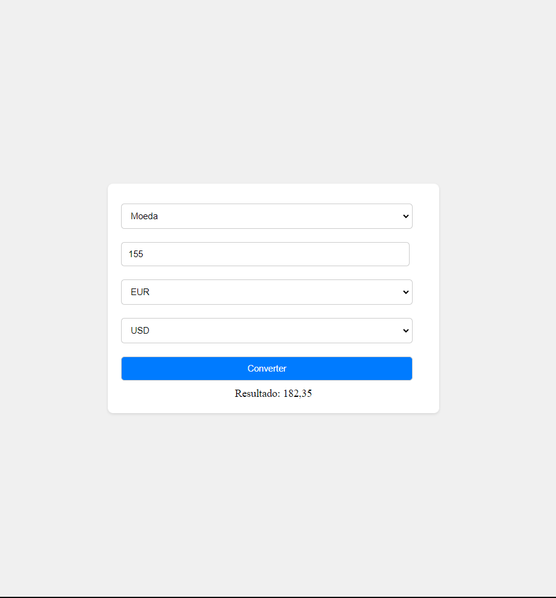

## Conversor de Medidas

Um conversor de medidas desenvolvido por Victor Junqueira, utilizando HTML, CSS e JavaScript, apresenta um design responsivo e uma interface de usuário intuitiva que permite a conversão fácil entre diferentes unidades de medida, incluindo distância, temperatura e moeda. 

